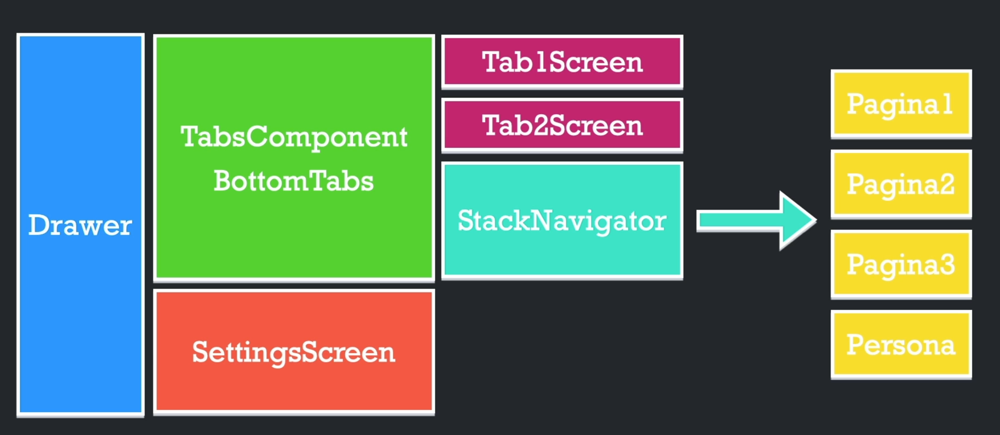

# Estructura de navegación en REACT NATIVE

Estructura base para referencia de navegación en una app hecha en react native.

## Tipos de navegación

- [@stack-navigator](https://reactnavigation.org/docs/stack-navigator)

- [@drawer-navigator](https://reactnavigation.org/docs/drawer-navigator)

- [@bottom-tab-navigator](https://reactnavigation.org/docs/bottom-tab-navigator)

## Estructura

 

## Authors

- [@drusystem](https://www.github.com/drusystem)
